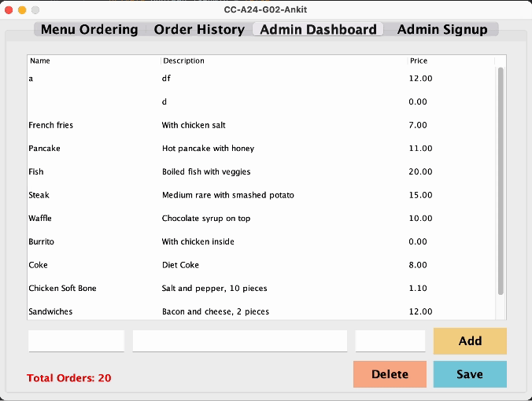

# Menu Application

## Table of Contents
**[Overview](#Overview)**<br>
**[Dependencies](#Dependencies)**<br>
**[Execute](#Execute)**<br>
**[Features](#Features)**<br>
**[References](#References)**<br>

## Overview

We are building a menu manager software application using Java Swing.

## Getting Started

### Dependencies

* JDK 17
* Gradle 8.3

### Execute
Clone the repo, `cd` to `javaswing-menu-app` 
```
gradle clean build run
```

### Features

* **Important note**
  
  **Order History**
  
  * For `pickup`: name and phone number are required
  * Phone number must be an 10-digit integer that starts with 04
  * For `delivery`: address is required
 
  **Admin Dashboard**
  
  * Price will be reset if user enter any string
  * If `Enter`, price will be updated immediately
  * Else, table view will be fixed after pressing `Save`
  * Price must be numeric and positive, ie: 9. is allowed
  * Row with empty food name and description will be filtered during `Save`

* **Login System**

  * Distinguish between admin and general users
  * Only admin can log in using an account
  * After logged in, Admin can sign up for another Admin
  * General users will sign in as guests.
 
<p align='center'>
  
</p>

<p align='center'>
  
</p>

* **Menu Ordering**

  * Select meals from menu
  * View item names, descriptions, and prices
  * Add items to order cart
  * Adjust item quantities
  * Remove items from the cart
  * Selecting delivery or pickup options and confirming the order
  * General users are not required to log in
 
<p align='center'>
  
</p>

<p align='center'>
  
</p>

* **Order History**

  * Only Admin can access order history
  * View order date, items ordered and total amount
  * Search orders based on order number
 
<p align='center'>
  
</p>

* **Admin Dashboard**

  * Only Admin can access admin dashboard
  * Overview of application's status (total orders proccessed)
  * Add new menu items (including a name, description and price for each item)
  * Update existing items (e.g. correcting prices or descriptions)
  * Remove outdated items from the menu
 
<p align='center'>
  
</p>

## References

Window listener https://www.tabnine.com/code/java/methods/java.awt.Window/addWindowListener
https://docs.oracle.com/javase/8/docs/api/java/awt/event/WindowListener.html

Login, Java Swing Syntax https://www.youtube.com/playlist?list=PLyVKCvpm4iiS-NZ0z349Sg-muhayUK-p_

Color https://htmlcolorcodes.com/

Divide windows to tabs https://stackoverflow.com/questions/8752037/how-to-change-background-color-of-jtabbedpane/8752166#8752166

Scrolled pane https://stackoverflow.com/questions/21636895/how-to-add-a-scroll-bar-to-a-jtabbedpane-basically-i-have-an-admin-panel-which

Append line to file https://stackoverflow.com/questions/1625234/how-to-append-text-to-an-existing-file-in-java

JTable in jscrolledpane https://stackoverflow.com/questions/72838796/how-to-individually-set-the-width-of-a-row-on-a-table-scrollpane

JTable column size https://stackoverflow.com/questions/17627431/auto-resizing-the-jtable-column-widths

JColumn only accept numeric value, keyevent to handle double input, no blank
https://allaboutbasic.com/2011/01/01/jtable-cell-validation-how-to-make-jtable-cell-allow-or-accept-only-integer-numeric-numberdata/
https://stackoverflow.com/questions/4673350/detecting-when-user-presses-enter-in-java
https://stackoverflow.com/questions/33348481/restrict-input-of-jtextfield-to-double-numbers
https://www.tutorialspoint.com/how-to-create-defaulttablemodel-which-is-an-implementation-of-tablemodel
https://stackoverflow.com/questions/72838796/how-to-individually-set-the-width-of-a-row-on-a-table-scrollpane
https://stackoverflow.com/questions/7531513/how-to-mark-jtable-cell-input-as-invalid
https://stackoverflow.com/questions/45269543/set-placeholder-onjpasswordfield

Close jframe from sub jpanel https://stackoverflow.com/questions/17829098/how-to-close-specific-jframe-based-on-events-on-jpanel-without-exiting-applicati
https://stackoverflow.com/questions/33192921/why-is-java-gui-jframe-size-different-sizes-on-different-operating-systems?utm_medium=organic&amp;utm_source=google_rich_qa&amp;utm_campaign=google_rich_qa

JTable allow select but not editable https://stackoverflow.com/questions/9919230/disable-user-edit-in-jtable
https://stackoverflow.com/questions/1990817/how-to-make-a-jtable-non-editable

JTable cell jtextfield editable in 1 click https://stackoverflow.com/questions/7387099/single-click-to-edit-a-jtable-cell

Read cell value while it’s being edited (so save without tapping another row in column or enter to save) https://stackoverflow.com/questions/33739941/read-cell-value-in-jtable-while-it-is-being-edited

Change button color on mac https://stackoverflow.com/questions/1065691/how-to-set-the-background-color-of-a-jbutton-on-the-mac-os#:~:text=Normally%20with%20Java%20Swing%20you,setBackground(Color.

Sign up inside https://www.youtube.com/watch?v=hElEQZ4lyPQ&amp;list=LL&amp;index=22

Change row height (not JTable) https://stackoverflow.com/questions/7229226/should-i-avoid-the-use-of-setpreferredmaximumminimum-size-methods-in-java-sw

Search bar https://stackoverflow.com/questions/22066387/how-to-search-an-element-in-a-jtable-java
